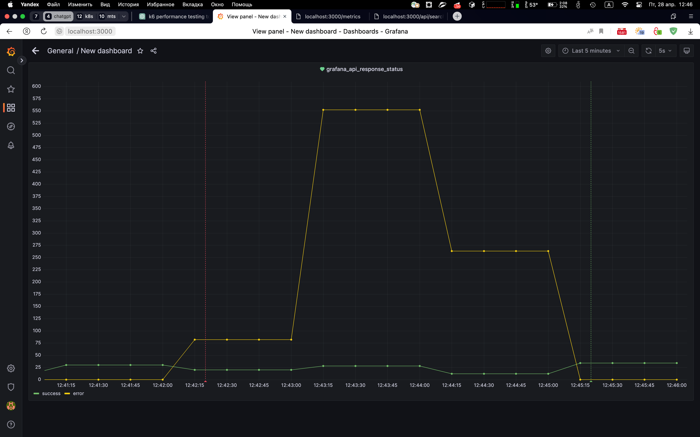
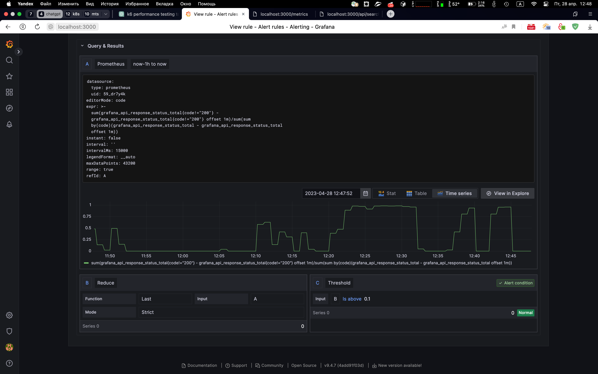

# Команда запуска нагрузки

`k6 run --vus 5 --duration 10m --rps 10 k6.js`

# Конфигурация для k6
```
import http from 'k6/http';
import { check } from 'k6';

export default function () {
  let endpoint = '';
  if (Math.random() < 0.9) { // 90% запросов на первый эндпоинт
    endpoint = 'http://localhost:3000/api/search?query=&tag=&starred=';
  } else { // 10% запросов на второй эндпоинт
    endpoint = 'http://localhost:3000/api';
  }

  let res = http.get(endpoint);
  check(res, { 'status is 200': (r) => r.status === 200 });
}
```
# Скриншоты
